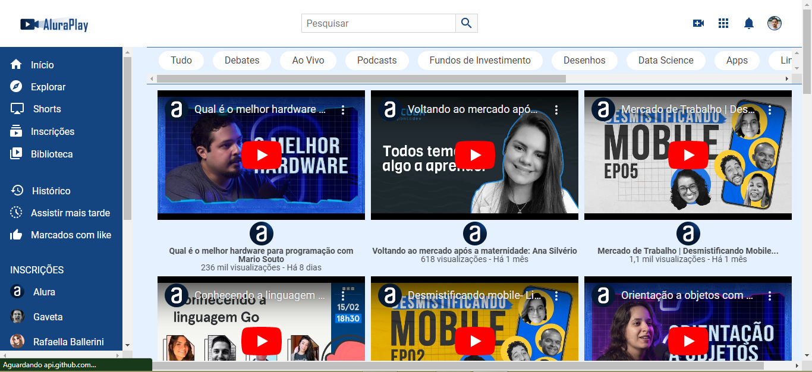
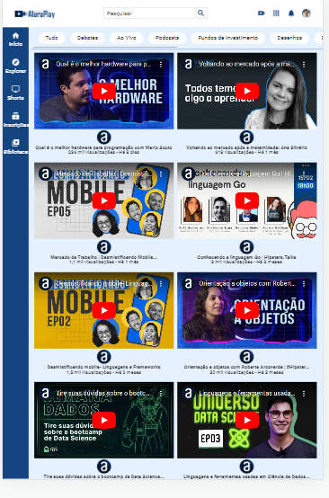

<h1 align="center">AluraPay</h1>

Será feito um  projeto, chamado AluraPlay, que é uma plataforma de vídeos com um layout moderno e rico em elementos. Esse projeto possui três telas principais, para celulares, tablets e desktops.

<h1>Índice</h1>

<h2 align="center">
 <a href="#objetivo">Objetivo</a> • 
 <a href="#tecnologias">Tecnologias</a> •   
 <a href="#autor">Autor</a>
</h2>

<h1 id="objetivo">Objetivo</h1>

O projeto foi feito com o objetivo de treinar Flexbox e responsividade. Começaremos analisando a tela para celulares, que possui um cabeçalho com logo e ícones. Abaixo desse cabeçalho, teremos uma seção com várias opções de navegação no site. 

Logo abaixo, temos uma seção de vídeos, incluindo dezesseis vídeos - todos do canal da Alura. Você pode, inclusive, assistí-los depois!

Ao fim da página, temos um rodapé com vários tópicos relacionados à área da tecnologia, além de um menu inferior com cinco opções de navegação no site.

  

<h2>Agora analisaremos o layout para tablets.</h2>

Nele, o menu que anteriormente era inferior é movido para a lateral esquerda, e o cabeçalho passa a possuir um campo de pesquisa. Os vídeos ficam organizados dois por linha, o rodapé expande de tamanho e os tópicos de tecnologia são quebrados em quatro colunas.
  

<h2>Por fim, analisaremos o layout para desktops.</h2>

Neste layout, o menu expande de tamanho e ganha mais elementos, os vídeos são distribuídos mais por linha e o rodapé se expande com os tópicos um ao lado do outro.
  